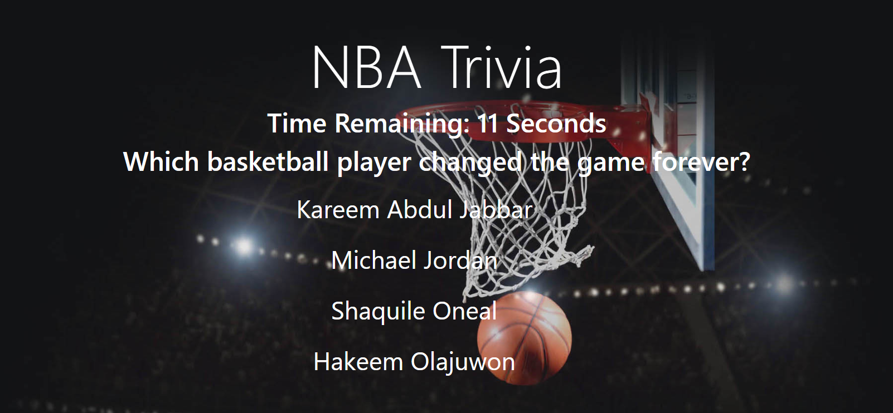

 # Project Name
 NBA Trivia Game

## Table of contents
* [General info](#general-info)
* [Screenshots](#screenshots)
* [Technologies](#technologies)
* [See it live](#see-it-live)
* [Status](#status)
* [Contact](#contact)

## General info
This fun app will test your basic basketball IQ! Do you have what it takes to be pass this simple test and to be considered a true fan of the sport?
Read the first question, try to answer it to the best of your ability, select an answer and watch what happens. Thats it! 

## Screenshots

## Technologies
 * Javascript 
 * J query
 * CSS 
 * Github pages for deployment

 ## Play the Game
 https://asanchez3315.github.io/Trivia-Game/

## Status
Project is: Finished

## Contact
Created by [@asldesigns](https://portfolio.aslwebdesign.net) - feel free to contact me!

